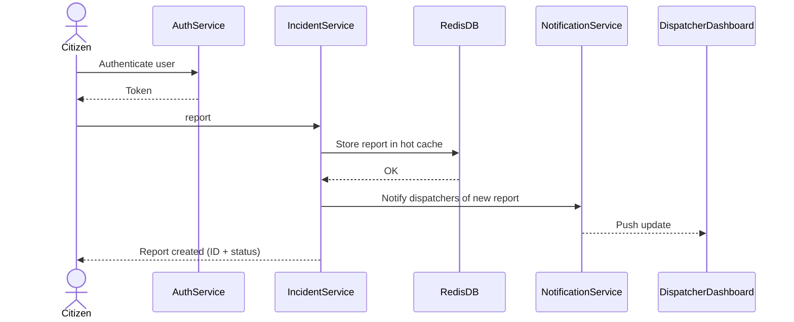
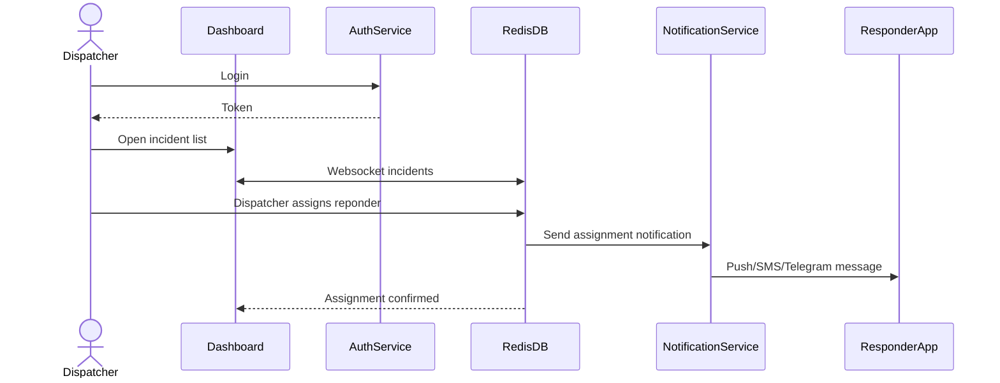
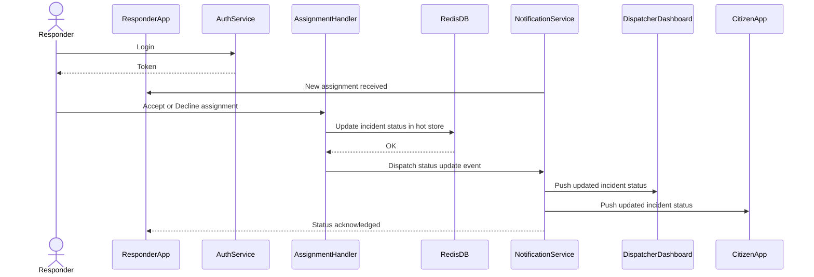
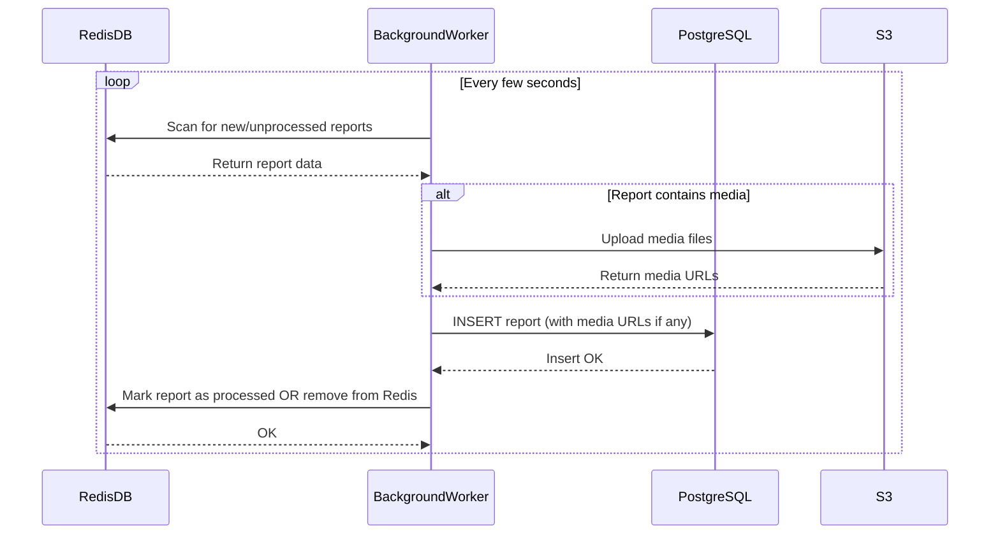

# Emergency Dispatch System  
FE405 – Designing Apps and APIs

## Summary
This project is an emergency reporting and dispatch system. Citizens submit incidents, dispatchers manage those incidents, and responders receive assignments and update the status. 

## User roles
Citizen: submits reports  
Dispatcher: views reports and assigns responders  
Responder: receives assignments and updates progress  

---

# Project elements

### System components
1. Citizen app or web form for creating reports
2. Dispatcher dashboard with incident list and assignment controls
3. Responder interface for receiving tasks and sending status updates
4. Backend service for incidents, users, assignments, and notifications
5. Database for storing reports, users, and status history

---

# Architecture

### Patterns
The MVP will start as one backend service rather than many. This avoids early complexity.  
If needed, notifications or incident handling could be separated later.

### Communication
Frontends talk to the backend over HTTP.  
The backend reads and writes to the database.  
Notifications may run as background jobs so they do not block requests.  
Status updates can be pulled periodically or streamed later if needed.

---

# AuthN and AuthZ

AuthN:  
All users authenticate with basic login.

AuthZ:  
Permissions depend on role.  
- Citizens can only submit and view their own reports  
- Dispatchers can view all reports and assign responders  
- Responders can only view incidents assigned to them and update status  

---
# User Flows

### This is the example flow chart of a citizen making a report:

### This is the example flow chart of the dispatcher receiving the report and assigning a responder:

### This is the example flow chart of the reponder receiving their report from dispatch:

### This is the example flow chart of how the system would use Redis as a quick and temp system for reports, which after a few seconds would get moved to the postgreSQL DB for long term storage:

## Phase I Architecture

This system operates in the critical infrastructure space, where delayed or
dropped updates could result in real world issues. As a result, the minimum
viable implementation must already meet baseline requirements for reliability, responsiveness, and operational safety.

While a theoretical MVP could be defined with a single backend service and a single database, a system like that would not be suitable for emergencies.
For this reason, the Phase I architecture represents the first releasable
version of the system and includes the minimum components required for safe, real-world use.

### Phase I Components

- Citizen public app / web app for submitting emergency reports
- Dispatcher dashboard for viewing and assigning incidents
- Responder mobile app for receiving assignments and updating status
- Backend API (initially deployed as a monolith)
- Redis used as a temporary hot store for active incidents
- WebSocket connections for real-time incident updates
- Background workers for asynchronous processing
- Notification system (SMS / messaging / push notifications)
- PostgreSQL database for long-term persistence
- Object storage (S3) for uploaded media

## Phase II Architecture

Phase II focuses on scaling the system and improving maintainability as usage,
incident volume, and team size increase.

The goal of this phase is to reduce coupling, improve fault isolation, and
support horizontal scaling without changing core user workflows.

## Phase II

Phase II focuses on improving the system as usage grows and as more people begin
to rely on it during real emergencies. While the Phase I architecture should be
sufficient for early use, higher traffic and more simultaneous incidents may
introduce new challenges over time.

At this stage, the goal is not to change how users interact with the system, but
to make the internal structure more resilient and easier to operate.

### Planned Phase II Changes

- Begin separating the backend into smaller services based on responsibility.
  For example, incident handling, responder assignments, and notifications could
  be split so that issues in one area are less likely to impact the entire
  system.

- Introduce a message queue to handle important events such as new reports or
  status updates.
  This may help ensure that notifications are still delivered during traffic
  spikes or partial failures.

- Reduce reliance on scheduled Redis scans and instead react to changes as they
  happen.
  This could help shorten the time between a report being submitted and a
  responder seeing it.

- Dispatchers now have the ability to assign priority to the indicences/reports.

- Responders now have the ability to share their location with the citizen.

- Allow backend services to run on multiple instances.
  This would improve availability and make the system more tolerant of server
  failures or sudden increases in load.

- Add more elaborate logging and monitoring to better understand how the system behaves
  in production.
  This would make it easier to identify slow paths, errors, or unexpected system
  behavior.

- Run more interviews with emergency reponse units to better understand and tailor the app for them. Also interview civilians. 

## Future Phases

Future phases would focus less on system structure and more on the people using it every day. By this point, the system would already be stable and reliable, so improvements would mainly come from real experience and feedback rather than technical necessity.

One likely direction is improving how citizens understand what is happening after they submit a report. For example, clearer status messages or simple explanations of what each stage means could help reduce anxiety during stressful situations. This would be guided by feedback from citizens who feel unsure about whether their report is being handled.

Another future improvement could focus on dispatcher workload. If dispatchers begin to manage many incidents at once, tools such as suggested responder assignments, clearer visual grouping of related incidents, or simple reminders for unassigned cases might become useful. These features would only be added if dispatchers report feeling overloaded or if response times begin to slip.

## Project Implementation Teams

If I were building the MVP today, I would keep the team small. I remember from agile discussions that small, cross-functional teams tend to move faster early on, and at this stage the system is still simple enough that splitting into multiple teams would probably slow things down more than help.

For the MVP, I would use one team of around three to four developers. This team would work across the whole system, including the citizen app, dispatcher dashboard, responder interface, backend logic, and database. I have heard that this kind of setup helps build shared context early, which feels especially important for a system where all parts are tightly connected and mistakes can have real consequences.

Once the system moves into Phase I and becomes a fully releasable product, the team structure would likely need to change as the scope grows. As more features are added and reliability becomes more important, it would make sense to start splitting responsibilities more clearly. I remember learning about Conway’s Law, which suggests that system structure often mirrors team structure, so doing this intentionally could help keep the system easier to reason about.

At that point, I would expect two or three small teams. One team could mainly focus on the user facing interfaces, while another focuses on backend logic and data reliability. Decisions about changing the team structure would be guided by practical signals such as slower development, higher incident volume, or feedback from users about delays or system issues, rather than following a rigid plan decided in advance.