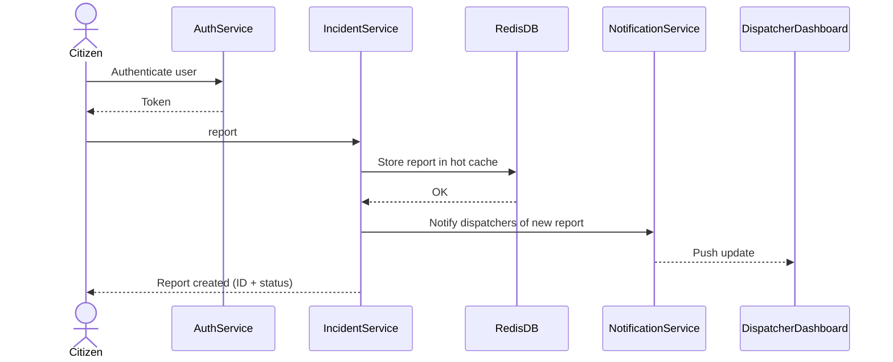
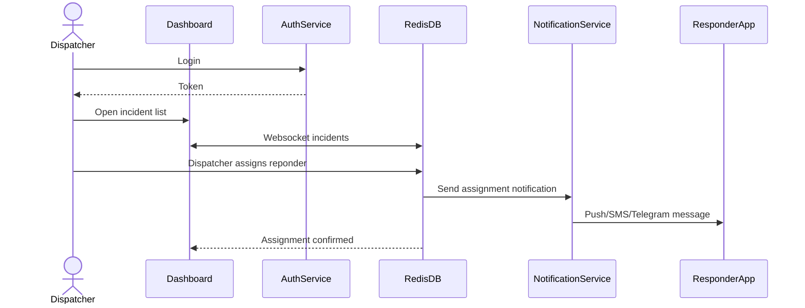
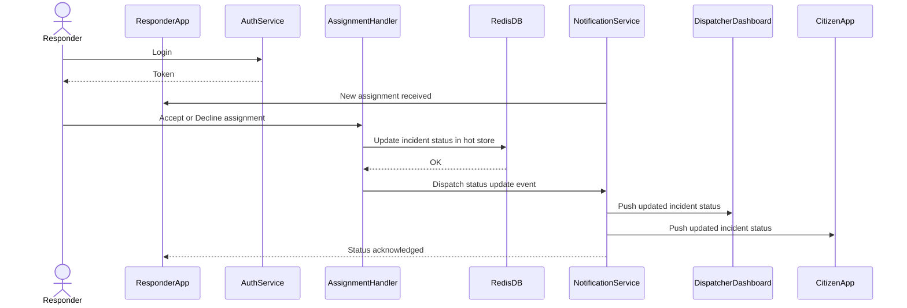
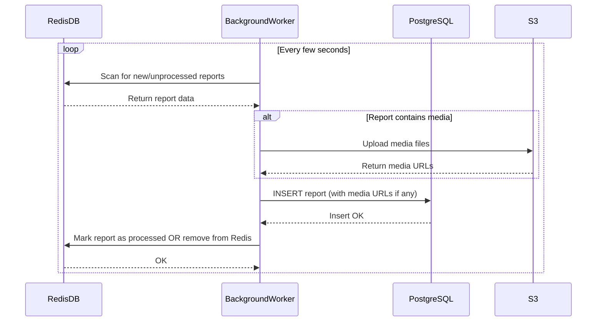

# Emergency Dispatch System  
FE405 – Designing Apps and APIs

## Summary
This project is an emergency reporting and dispatch system. Citizens submit incidents, dispatchers manage those incidents, and responders receive assignments and update the status. 

## User roles
Citizen: submits reports  
Dispatcher: views reports and assigns responders  
Responder: receives assignments and updates progress  

---

# Project elements

### System components
1. Citizen app or web form for creating reports
2. Dispatcher dashboard with incident list and assignment controls
3. Responder interface for receiving tasks and sending status updates
4. Backend service for incidents, users, assignments, and notifications
5. Database for storing reports, users, and status history

---

# Architecture

### Patterns
The MVP will start as one backend service rather than many. This avoids early complexity.  
If needed, notifications or incident handling could be separated later.

### Communication
Frontends talk to the backend over HTTP.  
The backend reads and writes to the database.  
Notifications may run as background jobs so they do not block requests.  
Status updates can be pulled periodically or streamed later if needed.

---

# AuthN and AuthZ

AuthN:  
All users authenticate with basic login.

AuthZ:  
Permissions depend on role.  
- Citizens can only submit and view their own reports  
- Dispatchers can view all reports and assign responders  
- Responders can only view incidents assigned to them and update status  

---
# User Flows

### This is the example flow chart of a citizen making a report:

### This is the example flow chart of the dispatcher receiving the report and assigning a responder:

### This is the example flow chart of the reponder receiving their report from dispatch

### This is the example flow chart of how the system would use Redis as a quick and temp system for reports, which after a few seconds would get moved to the postgreSQL DB for long term storage
