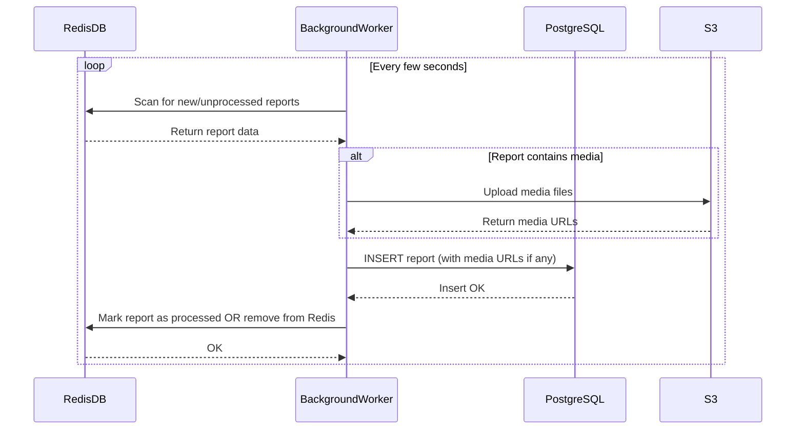

```mermaid
sequenceDiagram
    participant RedisDB
    participant BackgroundWorker
    participant PostgreSQL
    participant S3

    loop Every few seconds
        BackgroundWorker ->> RedisDB: Scan for new/unprocessed reports
        RedisDB -->> BackgroundWorker: Return report data

        alt Report contains media
            BackgroundWorker ->> S3: Upload media files
            S3 -->> BackgroundWorker: Return media URLs
        end

        BackgroundWorker ->> PostgreSQL: INSERT report (with media URLs if any)
        PostgreSQL -->> BackgroundWorker: Insert OK

        BackgroundWorker ->> RedisDB: Mark report as processed OR remove from Redis
        RedisDB -->> BackgroundWorker: OK
    end
```