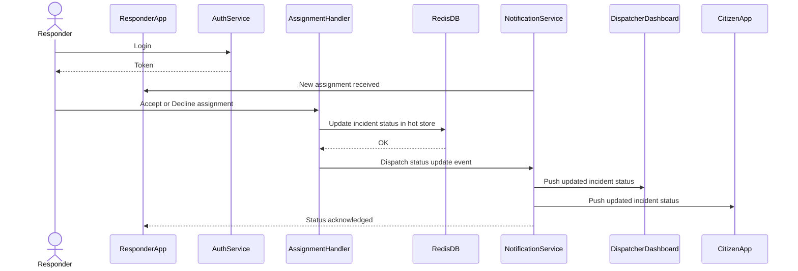

```mermaid
sequenceDiagram
    actor Responder
    participant ResponderApp
    participant AuthService
    participant AssignmentHandler
    participant RedisDB
    participant NotificationService
    participant DispatcherDashboard
    participant CitizenApp

    Responder ->> AuthService: Login
    AuthService -->> Responder: Token

    NotificationService ->> ResponderApp: New assignment received

    Responder ->> AssignmentHandler: Accept or Decline assignment
    AssignmentHandler ->> RedisDB: Update incident status in hot store
    RedisDB -->> AssignmentHandler: OK

    AssignmentHandler ->> NotificationService: Dispatch status update event

    NotificationService ->> DispatcherDashboard: Push updated incident status
    NotificationService ->> CitizenApp: Push updated incident status
    NotificationService -->> ResponderApp: Status acknowledged
```